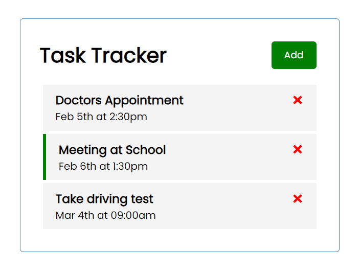

# React Task Tracker

- Task tracker made with React. Users can add and remove tasks, update reminders and toggle form.

## Live Demo

[Live version]()

## :hammer: Built With

- JavaScript
- React

## 🤝 :raised_hand: :raised_hand: Contributing

Contributions, issues and feature requests are welcome!

Feel free to check the [issues page](https://github.com/karmaester/react-task-tracker/issues).

## :muscle: Show your support

Give a ⭐️ if you like this project!

## :grey_exclamation: Acknowledgments

- [Traversy Media](https://www.youtube.com/watch?v=w7ejDZ8SWv8)

## 📝 License

This project is [MIT](https://opensource.org/licenses/MIT) licensed.